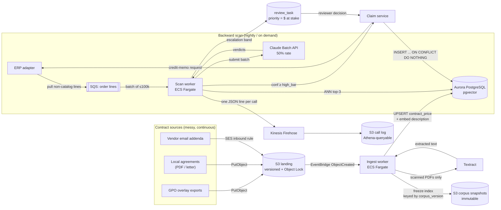
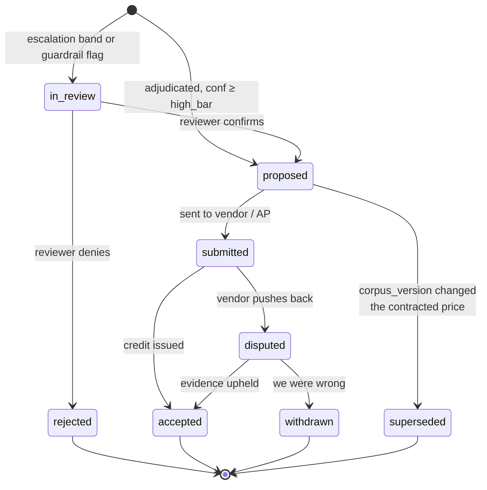
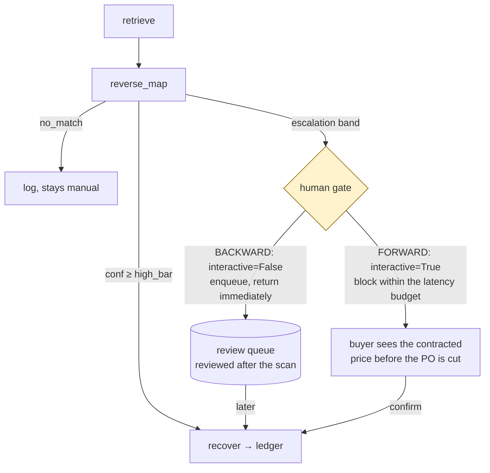

# Backtrace in production — system design, deployment, and architecture

**Status:** design proposal · **Scope:** one health system today, multi-tenant tomorrow
**Date:** 2026-08-21 · **Companion to:** [`../README.md`](../README.md), [`../CLAUDE.md`](../CLAUDE.md)

---

## 0. What this document is

Two documents, layered.

The **spine** (§1–§13) is a design review: what Backtrace becomes when it runs against a
real health system's spend, and why each choice is the one I would defend. It describes
the system as designed, not as it exists in the repository today.

The **last section** (§14) is the bridge: every decision above, mapped to a concrete
change in this codebase — file, shape of the diff, definition of done. Read §1–§13 to
evaluate the thinking; read §14 to build it.

Where the prototype already implements a decision correctly, this says so in one line
and moves on. It does not re-argue what the README already covers (retrieve-then-judge,
the five guardrail layers, why accuracy is the wrong headline metric). Those are
settled. This is about what changes when the input goes from six order lines to a
hundred thousand.

**The claim this document is organised around:**

> Inference cost is a rounding error. Reviewer attention is the scarce resource.
> Every architectural decision below is downstream of that.

That is not a slogan — it is an arithmetic result, derived in §2 and §3, and it inverts
the instinct most LLM systems are built on. A system that optimises tokens is
optimising the cheapest input it has.

---

## 1. The business case, quantified

Resolvd's published case study gives three numbers: **$49M scanned → $12M found under
contract but paid at list → $1.5–2M recoverable.** Everything below is backed out from
those, with each inferred step stated as an assumption so it can be challenged.

| # | Quantity | Value | Where it comes from |
|---|---|---|---|
| A1 | Non-catalog spend scanned, per health system per year | **$49M** | Case study |
| A2 | Average non-catalog line value | **$490** | *Assumption.* Med-surg supply lines cluster in the hundreds |
| A3 | Order lines per annual scan | **100,000** | A1 ÷ A2 |
| A4 | Spend found under contract | **$12M** (24.5%) | Case study |
| A5 | Lines matched to a contract | **~24,500** | A4 ÷ A2, at the same average line value |
| A6 | Recoverable | **$1.5–2M** | Case study — 12.5–16.7% of A4 |
| A7 | Implied average list-to-contract delta | **~15%** | A6 ÷ A4 |
| A8 | Recovery per matched line | **$61–$82** | A6 ÷ A5 |

A8 is the number to hold onto. **A matched line is worth about $80.** It is what makes
a human review economically defensible, and it sets the price ceiling on avoiding one.

Two things follow immediately:

- **The unit of value is a line, not a scan.** A scan finding 24,000 lines instead of
  24,500 has lost $40,000. Recall is not a vanity metric here.
- **The unit of damage is also a line.** One false claim — a demand for money against a
  vendor who owes none — costs far more than $80 in credibility, and unlike a miss it is
  *visible to the counterparty*. The asymmetry the README builds the confidence policy
  around is the same asymmetry that shapes the architecture.

---

## 2. Inference cost, computed rather than assumed

Rates below are the published per-million-token prices and cache multipliers (reads
≈ 0.1×, 5-minute writes ≈ 1.25×). The current cached prefix is **1,586 tokens** — a
measured number from `main.py --preflight`, not an estimate. The per-order suffix
(sanitised order text plus a 3-item shortlist) is ~350 tokens; output is schema-capped
at 300 and runs ~120.

The non-obvious input: **the minimum cacheable prefix is per model and is not monotonic
across generations.** Claude Sonnet 5 caches from 1,024 tokens; Claude Haiku 4.5
requires 4,096. At a 1,586-token prefix the precise tier caches and the fast tier does
not.

| Tier | Model | Prefix caches? | Input | Output | **Per call** |
|---|---|---|---|---|---|
| fast | `claude-haiku-4-5` ($1 / $5) | **No** — 1,586 < 4,096 | 1,950 tok @ full = $0.00195 | 120 tok = $0.00060 | **$0.00255** |
| precise | `claude-sonnet-5` ($3 / $15) | Yes — 1,586 ≥ 1,024 | 1,586 cached = $0.00048 <br> 350 fresh = $0.00105 | 120 tok = $0.00180 | **$0.00333** |

The first observation is already uncomfortable: **the "cheap" tier is only 23% cheaper
than the expensive one**, not the 3× the price sheet implies, because the cache-minimum
asymmetry cancels most of Haiku's advantage. Model tiering is buying much less than it
appears to.

Annual scan, using §1's volumes and the retrieval floor that short-circuits obvious
negatives with no model call at all (it fires on the `absent` category in the eval set;
assume 55% of lines on real spend):

```
100,000 lines
  ├─ 55,000 below the retrieval floor  → NO_MATCH, zero model calls, $0
  └─ 45,000 adjudicated                → 60% fast / 40% precise
       blended per-call cost           = 0.6($0.00255) + 0.4($0.00333) = $0.00286
       annual inference                = 45,000 × $0.00286 ≈ $129
       on the Batch API (50%)          ≈ $65
```

**An annual scan of a $49M spend book costs under $130 of inference, and under $70 as a
batch.** Against $1.5–2M recovered that is **under one basis point** of the money it
finds. If inference tripled in price tomorrow, nothing about this system's economics
would change.

### 2.1 The prefix-length trap, and why not to fall into it

The natural next move is to grow the system prompt past 4,096 tokens so the fast tier
caches too. It works, and it is counterintuitive in a satisfying way — *making the
prompt 2.6× longer makes the cheap tier 46% cheaper*:

| Prefix | fast (Haiku 4.5) | precise (Sonnet 5) | Blended @ 60/40 | Annual |
|---|---|---|---|---|
| 1,586 tok (today) | $0.00255 (uncached) | $0.00333 | $0.00286 | **$129** |
| 4,200 tok | $0.00137 (**cached**) | $0.00411 | $0.00246 | **$111** |

It also hurts the precise tier, since a longer cached prefix still bills reads. Net:
**$18 a year.**

The correct conclusion from this table is not "grow the prefix." It is *stop optimising
here*. An engineer-day spent on prompt token economics returns $18/yr per tenant. The
same day spent shaving one point off the escalation rate returns, as §3 shows, twenty-
eight times that. This table is in the document precisely so nobody proposes the
optimisation again.

(There is an independent reason to grow the glossary — it is what lets the adjudicator
beat retrieval on domain shorthand like "pf" for powder-free. Do that for accuracy if
the evals support it. Do not do it for cost.)

---

## 3. What is actually scarce

The system produces two kinds of human work: **reviews** (an UNCERTAIN line someone must
adjudicate) and **disputes** (a filed claim a vendor pushes back on). Reviews are the
volume driver.

Measured escalation rate at the chosen bar (`high_bar = 0.85`): **26.6%**.

```
45,000 adjudicated lines × 26.6%   ≈ 12,000 review tasks / year
        × 90 seconds each          ≈ 300 hours = 7.5 FTE-weeks
        × $45/hr fully loaded      ≈ $13,500 / year
```

| | Annual cost | Ratio |
|---|---|---|
| Inference | ~$129 | 1× |
| **Reviewer attention** | **~$13,500** | **105×** |

Per unit:

| | Cost | Equivalent |
|---|---|---|
| One human review (90s @ $45/hr) | **$1.13** | — |
| One Sonnet 5 adjudication | $0.0033 | **340 adjudications = 1 review** |
| One Opus 5 adjudication (`claude-opus-5`, $5/$25, caches from 512 tok) | $0.0056 | **200 adjudications = 1 review** |

This is the design's central economic fact, and it points somewhere specific:

> **You can buy roughly 200 Claude Opus 5 adjudications for the price of one human
> review.** So the right move on an uncertain line is not to escalate it — it is to
> spend *more* inference on it, and escalate only what survives.

That gives the architecture a third tier a token-minimising design would never reach
for:

| Tier | Model | Routed when | Purpose |
|---|---|---|---|
| `fast` | `claude-haiku-4-5` | Runaway top candidate, wide margin | Confirm the obvious cheaply |
| `precise` | `claude-sonnet-5` | Top two candidates close | Get the near-duplicate right |
| **`deliberate`** *(new)* | **`claude-opus-5`**, adaptive thinking, `effort: high` | **Verdict landed in the escalation band** | **Buy back a human review for half a cent** |

One point of escalation rate = 450 reviews = 11 hours = **$506/yr**, which is 3.9× the
*entire* annual inference bill. A `deliberate` tier that resolves even a fifth of the
escalation band pays for itself several hundred times over.

**This is gated, not assumed.** The tier ships only if the eval harness shows it
converts escalations into auto-matches *without* moving `false_claims` off zero. An
escalation that becomes a false claim costs far more than the $1.13 it saved. §11 makes
that a release requirement rather than a good intention.

### 3.1 The metric this implies

Cost-per-token is not a KPI here. The KPI is:

```
                   reviewer-minutes + dispute-handling-minutes
human cost ratio = ────────────────────────────────────────────
                            dollars recovered
```

Every optimisation below is judged against that ratio. Inference enters it only as a
rounding error in the cost base.

---

## 4. What the prototype already gets right

Briefly, because these carry forward unchanged and the README argues them fully:

- **Retrieve-then-judge**, with the price math in Python and never in a prompt.
- **The model picks an index into a shortlist it did not select** — the layer that caps
  injection blast radius rather than merely raising the cost of an attack.
- **Failure abstains, never no-matches.** Timeout, refusal, malformed output,
  hallucinated SKU: all five become UNCERTAIN with a flag.
- **A guardrail flag outranks confidence**, and the check order in `agent.decide()`
  encodes it.
- **`decide()` is pure**, so the threshold sweep replays recorded verdicts at zero
  marginal API cost. This is why `high_bar = 0.85` is an ordering over measured rows
  rather than a magic number.
- **Provenance on every claim**: model, tier, prompt version, corpus version, candidate
  SKUs on the table, guardrail flags. §11 shows this is also what makes rollback
  surgical.

The rest of this document is about what breaks when N goes from 6 to 100,000.

---

## 5. Target architecture



### 5.1 Ingest and the corpus

Contract prices arrive continuously and in every format a hospital's supply chain team
has ever accepted. The prototype's three parsers become a **parser registry keyed by
source type**, with the same contract: messy bytes in, `ContractPrice` rows out, each
carrying its source document.

Three things change at scale:

- **Textract for scanned documents.** Local agreements arrive as scans of signed
  letters. Extraction confidence flows through as a field, and a low-confidence
  extraction marks the resulting price row `needs_verification` — a price the system is
  unsure it read correctly must never silently become the basis of a claim.
- **Effective dating replaces last-wins.** The prototype's "newest source overrides" rule
  is right in spirit and wrong in mechanism: it cannot answer *what was the contracted
  price on the day this PO was cut?* Production carries `effective_from` / `effective_to`
  per price row and selects the row effective on the order date. This matters directly —
  the email addendum in the sample corpus moves CTH-F16 from $4.20 to $3.60, and a claim
  against an order predating that email must use $4.20 or it is simply wrong.
- **Immutable corpus snapshots.** `corpus_version()` already hashes the index. Production
  writes the snapshot behind that hash to S3, so a claim from eighteen months ago can be
  recomputed against the exact index that produced it. The hash without the artefact is
  a fingerprint of something you threw away.

### 5.2 Retrieval

`pgvector` on Aurora, HNSW index, cosine distance, `k = 3`. At ~500k contract rows
across tenants this is a sub-20ms p95 query and there is no reason to run a separate
vector store.

**Embeddings stay in-process.** `all-MiniLM-L6-v2` is a ~90MB model; loading it once per
worker costs seconds at boot and nothing thereafter. A network hop per line, 100,000
times, buys a deployment dependency and a new failure mode in exchange for nothing.
Corpus embeddings are computed at ingest and stored, not recomputed per scan.

**Pin the embedding model version explicitly and record it on the snapshot.** A silent
sentence-transformers upgrade re-ranks every shortlist in the system with no error and
no diff. This is a supply-chain change disguised as a dependency bump; §9 lists it in
the silent-failure catalogue.

### 5.3 Adjudication

The gateway invariant holds unchanged — one `adjudicate()`, one client, one place a
model is named — and it is worth more at scale than at six orders. What changes:

- **The backward scan runs on the Batch API.** 50% off all token usage, up to 100,000
  requests per batch (an entire annual scan fits in one submission), most batches
  complete within an hour and all within 24. A historical sweep has nobody waiting on
  it; paying interactive rates for it is a pure loss.
- **The synchronous path keeps the concurrent fan-out** for forward mode (§8) and for
  re-adjudication after a corpus change.
- **Cache warm-up becomes correct rather than approximate.** A cache entry is readable
  only once the first response *begins streaming*; N parallel requests with identical
  prefixes all pay full price because none can read what the others are still writing.
  The current `warm_cache()` gets this right in principle by serialising one call per
  tier ahead of the fan-out. Production tightens it: use a `max_tokens: 0` prefill
  request (returns immediately, bills zero output tokens, writes the cache), and skip
  any tier whose prefix cannot clear that model's own minimum — warming a tier that
  cannot cache is a full-price call that writes nothing. Two constraints to respect:
  `max_tokens: 0` is rejected alongside `output_config.format` (drop it on the warm call
  — nothing parses the response, and the cached prefix is unaffected because
  `output_config` is not part of it), and it is rejected inside a Batch request, so the
  warm call must precede batch submission rather than ride inside it.

### 5.4 Recovery and the claim lifecycle

A recovery claim is a financial assertion with a lifespan measured in months. It is not
a row that gets written once.



Two states carry most of the design weight:

- **`disputed → withdrawn`** is the loop that makes the eval set improve. Every withdrawn
  claim is a labelled false positive with a documented reason, and it goes straight into
  `evals/dataset.json` as a `trap` case. The system's error rate is the only source of
  training signal that is actually about this customer's contracts.
- **`superseded`** exists because contract prices change under claims in flight. A claim
  computed against `corpus_version` `a1b2c3` when the current index is `d4e5f6` must be
  recomputed before it is submitted, not after a vendor points out the discrepancy.

### 5.5 The review plane

Given §3, the review queue is not a UI afterthought — it is where the operating cost
lives. Three properties it must have:

1. **Ordered by dollars at stake, not arrival.** `(list − contract) × qty` is already
   computed. A reviewer working a $12,000 line before a $40 line is worth ~300× more per
   minute. FIFO here is an unforced error.
2. **Batched by shape.** Twelve thousand reviews are not twelve thousand distinct
   problems. Grouping by "same rejected candidate pair" or "same vendor-not-on-contract
   pattern" lets one decision resolve dozens, and turns the median review from 90 seconds
   into something far shorter.
3. **Every decision is training data.** The reviewer's choice, the candidates shown, and
   the agent's rationale are all persisted. This is the flywheel; a queue that discards
   the reasoning keeps the cost and throws away the return.

---

## 6. Data model

Postgres, one schema, `tenant_id` on every table with row-level security. Abbreviated to
the columns that carry design weight.

```sql
-- Contract prices, effective-dated, with provenance to a source document.
CREATE TABLE contract_price (
  id                     bigserial PRIMARY KEY,
  tenant_id              uuid        NOT NULL,
  sku                    text        NOT NULL,
  vendor                 text        NOT NULL,
  description            text        NOT NULL,
  contracted_unit_price  numeric(12,4) NOT NULL,
  uom                    text        NOT NULL,   -- each / box-100 / case-10
  source_document_id     uuid        NOT NULL REFERENCES source_document(id),
  effective_from         date        NOT NULL,
  effective_to           date,                    -- NULL = currently in force
  extraction_confidence  real,                    -- from Textract; NULL if structured
  needs_verification     boolean     NOT NULL DEFAULT false,
  embedding              vector(384) NOT NULL,
  CONSTRAINT no_overlapping_terms
    EXCLUDE USING gist (tenant_id WITH =, sku WITH =,
                        daterange(effective_from, effective_to) WITH &&)
);
CREATE INDEX ON contract_price USING hnsw (embedding vector_cosine_ops);

-- One immutable, content-addressed snapshot of the whole index.
CREATE TABLE corpus_snapshot (
  corpus_version   char(12) PRIMARY KEY,   -- corpus.corpus_version()
  tenant_id        uuid NOT NULL,
  s3_uri           text NOT NULL,
  embedding_model  text NOT NULL,          -- pinned; a bump re-ranks everything
  row_count        int  NOT NULL,
  created_at       timestamptz NOT NULL DEFAULT now()
);

-- One adjudication. Append-only: re-running writes a new row, never an update.
CREATE TABLE adjudication (
  id                     uuid PRIMARY KEY,
  tenant_id              uuid NOT NULL,
  order_line_id          uuid NOT NULL REFERENCES order_line(id),
  decision               text NOT NULL,   -- match | uncertain | no_match
  confidence             real NOT NULL,
  matched_contract_id    bigint REFERENCES contract_price(id),
  rationale              text,
  -- provenance: schema.ReverseMapResult already carries every one of these
  model                  text, tier text, prompt_version text,
  corpus_version         char(12) REFERENCES corpus_snapshot(corpus_version),
  candidates_considered  text[] NOT NULL,
  guardrail_flags        text[] NOT NULL DEFAULT '{}',
  request_id             text,            -- ties back to the call log
  latency_ms             real, cost_usd numeric(10,6),
  created_at             timestamptz NOT NULL DEFAULT now()
);

-- The claim. Idempotency is a database constraint, not a mutex.
CREATE TABLE recovery_claim (
  id                     uuid PRIMARY KEY,
  tenant_id              uuid NOT NULL,
  order_line_id          uuid NOT NULL REFERENCES order_line(id),
  adjudication_id        uuid NOT NULL REFERENCES adjudication(id),
  status                 text NOT NULL,   -- see §5.4 state machine
  list_unit_price        numeric(12,4) NOT NULL,
  contracted_unit_price  numeric(12,4) NOT NULL,
  quantity               numeric(12,3)  NOT NULL,
  recoverable_usd        numeric(12,2)  NOT NULL,
  decided_by             text NOT NULL,   -- agent | human
  reviewer_id            uuid,
  created_at             timestamptz NOT NULL DEFAULT now()
);

-- The invariant recovery.py protects with threading.Lock, expressed where it holds
-- across every process, worker, and retry: at most one live claim per order line.
CREATE UNIQUE INDEX one_live_claim_per_line
  ON recovery_claim (tenant_id, order_line_id)
  WHERE status NOT IN ('withdrawn', 'rejected', 'superseded');

-- Append-only audit. The claim row is current state; this is how it got there.
CREATE TABLE claim_event (
  id          bigserial PRIMARY KEY,
  claim_id    uuid NOT NULL REFERENCES recovery_claim(id),
  from_status text, to_status text NOT NULL,
  actor       text NOT NULL,   -- 'agent' | user id | 'system:corpus_change'
  reason      text,
  at          timestamptz NOT NULL DEFAULT now()
);
```

Three notes on the choices:

- **`numeric`, never `float`, for money.** The prototype's `float` is fine for a demo and
  indefensible in a ledger.
- **`EXCLUDE USING gist`** makes overlapping effective-dated prices for one SKU
  *impossible to insert* rather than something a reconciliation job discovers later.
- **The partial unique index is the whole idempotency story.** `recovery.py` uses a
  `threading.Lock`, which is exactly right for one process and provides no protection
  whatsoever against two workers, a retried SQS message, or a redeployed task. Moving the
  invariant into the database is the single most important change in this document,
  because a double claim against a vendor is worse than a missed one.

---

## 7. What breaks between 6 orders and 100,000

The honest list. Each is a real defect at scale, not a nice-to-have.

| # | Breaks | Why | Fix |
|---|---|---|---|
| 1 | **Idempotency** | `threading.Lock` + read-modify-write of a JSON file protects one process. Two workers double-claim. | Partial unique index (§6); `INSERT … ON CONFLICT DO NOTHING` |
| 2 | **The ledger** | Rewriting the entire JSON file per claim is O(n²) over a scan and loses everything on a crash mid-write | Postgres + append-only `claim_event` |
| 3 | **Corpus in memory** | `build_corpus()` parses three files into a process-global list. 500k rows across tenants will not sit in every worker | pgvector; retrieval is a query, not a scan |
| 4 | **No effective dating** | "Newest wins" cannot price an order that predates the newest source | `effective_from` / `effective_to`, selected on order date |
| 5 | **No tenancy** | Every path assumes one corpus, one threshold set, one ledger | `tenant_id` + RLS; per-tenant thresholds |
| 6 | **Reviews block** | The deferred gate is right, but the review itself is `input()` on stdin | Queue + web UI, prioritised by dollars (§5.5) |
| 7 | **No claim lifecycle** | A claim is written once and never transitions. Real claims get disputed, withdrawn, superseded | State machine (§5.4) |
| 8 | **Interactive pricing on a batch job** | The backward scan pays synchronous rates for work nobody is waiting on | Batch API, 50% |

Note what is *not* on this list: the agent, the guardrails, the confidence policy, the
gateway's contract, the eval harness. The core is sound; the surrounding plumbing is
demo-grade. That is the correct place for a prototype to be weak.

---

## 8. Two modes, one engine — and the one edge that differs

The README's "same engine, two modes" is architecturally real, and it is worth being
precise about exactly what differs, because it is a single edge in the graph.



Everything upstream of `human_gate` is byte-identical between modes. The seam is
`State["interactive"]`, and it already exists in `agent.py`.

What forward mode adds at scale is a **latency budget**, because a buyer is waiting:

| Stage | Budget (p95) |
|---|---|
| pgvector ANN over ~500k rows | 20 ms |
| Adjudication (`fast` / `precise`) | 2,500 ms |
| Price math + render | 30 ms |
| **End-to-end** | **< 4 s** |

With a **degrade-to-queue fallback**: if the budget is blown, the PO proceeds and the
line drops into the backward queue. A supply chain system that blocks a purchase order
because an optimisation was slow will be switched off within a week, and correctly so.
The `deliberate` tier from §3 is therefore backward-only — it is worth half a cent and
several seconds when nobody is waiting, and not when someone is.

Forward mode is also where the economics change: catching an overpayment *before* the
money leaves is worth more than clawing it back afterwards, because there is no vendor
negotiation, no credit memo, and no relationship cost. The same engine, at a fraction of
the downstream friction.

---

## 9. Reliability, SLOs, and the silent-failure catalogue

### Service levels

| SLI | SLO | Why this number |
|---|---|---|
| Backward scan completion | 100k lines within 24 h | Batch API ceiling; scan is nightly-to-monthly |
| Forward adjudication p95 | < 4 s | Buyer is waiting (§8) |
| **False claim rate** | **0 per release, gated pre-deploy** | §11 — this is the gate, not an aspiration |
| Escalation rate | ≤ 30%, alert on +5pp week-over-week | Drift here is the main cost signal (§3) |
| Review queue age p95 | < 5 business days | Aged queue = unrealised recovery |
| Cache hit rate | > 40% on interactive scans | A silent cache miss has no other symptom |

### The silent-failure catalogue

The failures that matter in this system are the ones that do not raise. Each row here is
a real mechanism, and each has a named detector — because a failure mode without a
detector is a failure mode you will learn about from a customer.

| Failure | Why it is silent | Detector |
|---|---|---|
| **Prompt cache never engages** | The API accepts `cache_control`, ignores it below the model minimum, and bills full price | `--preflight` per tier + alarm on `cache_hit_rate == 0` across a scan. *This already fired once in this repo:* the check compared both tiers against one global 1024 constant and reported "will engage: True" for Haiku 4.5, whose real minimum is 4,096 |
| **Retrieval ceiling** | If the right contract is not in the top-3, no prompt change can recover it — and the model confidently adjudicates the wrong shortlist | `recall@k` on a labelled slice, reported separately from precision |
| **Corpus staleness** | An old price produces a perfectly well-formed claim for the wrong amount | Age of newest `source_document` per vendor; alert past threshold |
| **Embedding model drift** | A dependency bump re-ranks every shortlist. No error, no diff | Pin the version; store it on `corpus_snapshot`; `recall@k` regression in CI |
| **Model or prompt drift** | New model version, same code, different judgement | Pinned model ids + eval gate + canary (§11) |
| **Suppression injection** | Forcing `NO_MATCH` buries a recovery. Nobody audits money that was never claimed | `NO_MATCH` rate per vendor, per week, with anomaly detection. A vendor whose no-match rate diverges from the population is the signal |
| **Review queue starvation** | Zero claims filed looks identical to "no findings" | Queue depth and age as first-class SLIs; alert on growth |
| **Abstention spike** | API degradation surfaces as UNCERTAIN, which is *by design* indistinguishable from genuine uncertainty on one line | `blocked_by_guardrail` rate — `schema.py` already separates "the agent was unsure" from "something went wrong" |

That last row is why `ReverseMapResult.blocked_by_guardrail` exists. Without it, an
API outage and a hard glove-matching week produce the same queue.

### Failure containment

- **Every failure abstains.** Already true, and the property everything else rests on.
- **The ingest path is idempotent and content-addressed.** Reprocessing a document
  produces the same rows and the same `corpus_version`.
- **Poison-message handling.** SQS DLQ after three attempts; a line that cannot be
  adjudicated becomes a review task rather than a lost line.
- **The call log tolerates its own failure.** `_log_call()` swallows `OSError` — a
  dropped log line is recoverable, a scan that died having already filed half its claims
  is not. This stays true when the sink becomes Firehose.

---

## 10. Security, tenancy, and compliance

### 10.1 The threat model grows a second entrance

The README's threat model covers untrusted order text. At scale there is a second,
sharper one: **contract documents are also untrusted input**, and they arrive from
vendors by email.

The mitigation is structural and already half-built. Parsers extract *typed fields* —
SKU, price, vendor, description — and never free-form instructions. The authority for
what a SKU costs is a `numeric` column in a row, not text a model read. An injection in
a contract PDF reaches the model only as a `description` string inside a candidate the
model can select by index, which is exactly the blast radius the existing layer 3
already caps. The new requirement is that ingest-time extraction be flagged the same way
order text is: a description tripping the injection patterns marks the price row
`needs_verification` and keeps it out of auto-claims.

### 10.2 Tenancy

- `tenant_id` on every table, Postgres RLS, and a session-scoped role — so a missing
  `WHERE` clause is a query that returns nothing rather than a cross-tenant leak.
- **Per-tenant corpora.** Contracts are the tenant's most commercially sensitive asset;
  cross-tenant retrieval is not a feature to be careful with, it is one that must be
  impossible.
- **Per-tenant thresholds.** `high_bar` is a business decision about the price of
  reviewer time, and it differs by customer. `config.Thresholds` is already a frozen
  dataclass the eval sweeps — it becomes a per-tenant row, and the sweep runs per tenant.

### 10.3 PHI and data handling

Supply lines are usually not PHI. *Usually* is not a compliance posture: implantables and
case-linked orders can carry patient or case identifiers in free text.

- **Redact at ingest**, before text reaches storage or a prompt. Pattern-based MRN/date-
  of-birth detection on order descriptions, with detections logged.
- **BAA and zero-data-retention** on the inference path. Note this constrains model
  choice: `claude-fable-5` requires 30-day retention and is therefore ineligible under a
  ZDR configuration. Model selection here is a compliance decision, not only a cost one.
- **Immutable audit.** Call log and claim events to S3 with Object Lock. "Why are you
  clawing back $1,320 on PO-5001?" needs an answer that nobody could have edited.
- **KMS everywhere**, VPC endpoints, least-privilege task roles. The scan worker can read
  `contract_price` and write `adjudication`; it cannot write `recovery_claim`. Only the
  claim service can, and it is the only service holding the ERP credential.

### 10.4 Financial controls

This system asks vendors for money, which puts it under the customer's finance controls
whether or not it was designed for them:

- **Segregation of duties.** The agent *proposes*; submission to a vendor requires a
  human with vendor-relationship authority. The state machine enforces this — nothing
  reaches `submitted` from `proposed` without an actor on the `claim_event`.
- **Dual control above a dollar threshold.** Claims over (say) $10,000 need a second
  approver. This is one predicate on a state transition and it is the kind of thing that
  is trivial to add now and painful to retrofit after the first six-figure dispute.
- **Full reconstruction.** Every claim names its model, prompt version, corpus version,
  candidate shortlist, guardrail flags, and reviewer. `schema.py` already carries all of
  them; production just needs them in columns rather than a JSON file.

---

## 11. Evaluation as a release gate

The eval harness is the only thing standing between a prompt edit and a false claim
against a vendor. It should therefore be wired as a **gate**, not a report.

```
PR opened
  └─ pytest -q                          deterministic layers, no API key
  └─ run_eval --offline                 guardrails + retrieval recall, no API key
                                        BLOCKS MERGE on failure

Prompt / model / threshold change
  └─ run_eval --sweep (full, ~64 cases)
     GATE: false_claims == 0
     GATE: recall@k not regressed
     GATE: injection coverage 7/7
                                        BLOCKS DEPLOY on failure

Post-deploy
  └─ canary: 5% of lines dual-adjudicated on old + new prompt_version
     compare: agreement rate, precision on the labelled slice
     auto-rollback on divergence beyond tolerance

Continuous
  └─ every disputed → withdrawn claim becomes a labelled `trap` case
```

Three things make this more than CI theatre:

**The offline tier means the gate always runs.** `--offline` needs no credential, so
guardrail and retrieval regressions are caught on every PR from every contributor,
including forks. A gate that only runs when a secret is available is a gate that is off
by default.

**The gate is `false_claims == 0`, not a percentage.** §1's asymmetry, encoded in the
pipeline. Recall regressions warn; a single false claim blocks.

**Rollback is surgical because provenance is per claim.** When a bad prompt version
ships, the remediation is one query — every claim decided by `prompt_version =
'reverse-map/v4'` between two timestamps, transitioned to `superseded` and re-
adjudicated. Without the provenance columns the only honest options are "withdraw
everything" or "hope." This is the payoff for fields that look like bookkeeping in
`schema.py`.

And the loop that matters most: **the eval set must keep getting harder.** The README
records what happened when it did — an earlier 41-case set scored 100% precision at
every threshold from 0.60 to 0.95, which reads as a pass and was actually a measurement
failure, because no case in it could produce a confident wrong match. Expanding it
immediately exposed two live defects (an unrendered vendor field, and a blocking rule
written where the model could not apply it). Neither was reachable by a unit test; the
code did exactly what it said, and what it said was wrong. Production's version of that
loop is the dispute queue: every vendor pushback is a labelled case the customer paid
for. Not harvesting it is the most expensive omission available.

---

## 12. Cost and capacity summary

Per health system per year, at §1's volumes:

| Line item | Annual | Note |
|---|---|---|
| Inference (Batch API) | **~$65** | §2 |
| Aurora (db.r6g.large + storage) | ~$3,600 | Multi-AZ; shared across tenants in practice |
| Fargate (scan + ingest workers) | ~$400 | Bursty; scan is hours per month |
| S3 + Firehose + Textract | ~$200 | Snapshots, call log, scanned agreements |
| **Machine subtotal** | **~$4,300** | |
| **Reviewer attention** | **~$13,500** | §3 — 3.1× everything else combined |
| **Total cost to operate** | **~$17,800** | |
| **Recovered** | **$1.5–2M** | |

Inference is **0.4% of the machine bill and 0.004% of recovered dollars.** The reviewer
line is larger than all infrastructure combined. Any roadmap that ranks token
optimisation above review efficiency has read the wrong column.

Capacity headroom: one batch holds up to 100,000 requests, so a full annual scan is a
single submission; pgvector at ~500k rows is nowhere near needing a dedicated vector
store; Aurora at these write volumes is not a bottleneck. **Nothing here needs to be
distributed.** Saying so explicitly is part of the design — the failure mode of a
document like this is proposing Kafka for 100,000 rows a year.

---

## 13. Dependencies we do not own, and open questions

### 13.1 The ERP boundary

Backtrace does not own the ERP (Workday, Infor, Oracle, PeopleSoft — it varies by
customer), and the integration politics are the customer's, not the architecture's.
The design treats it as a **dependency with an assumed interface**, and every
implementation detail lives behind that interface:

```python
class ERPAdapter(Protocol):
    """The only surface Backtrace touches. One implementation per ERP."""

    def fetch_non_catalog_lines(
        self, since: date, until: date
    ) -> Iterator[OrderLine]:
        """Historical PO lines flagged non-catalog. Must be replayable —
        the scan is re-runnable and idempotency is enforced downstream."""

    def resolve_item_master(self, sku: str) -> ItemMasterEntry | None:
        """Does this SKU already exist in the catalog? Determines whether a
        confirmed match is a recovery or an item-master gap."""

    def submit_credit_request(
        self, claim: RecoveryClaim, idempotency_key: str
    ) -> ERPSubmission:
        """Post a credit-memo request. MUST be idempotent on the key — this
        is the boundary where a retry becomes a duplicate demand for money."""
```

Three assumptions this makes explicit, so they can be validated in a discovery call
rather than discovered in integration:

1. Non-catalog lines are **identifiable** in the ERP (a flag, an account code, or a
   supplier-type). If they are not, the first deliverable is a classifier, not a matcher.
2. Historical extracts are **replayable** without side effects.
3. Credit requests accept a **caller-supplied idempotency key**. If the ERP will not
   honour one, Backtrace must keep a submission ledger and reconcile — the same
   invariant, defended one layer further out.

Until an adapter exists, S3 CSV drops satisfy the same Protocol. That is not a
workaround; it is how you ship before the integration review finishes.

### 13.2 Open questions

- **Is the escalation band actually resolvable by a stronger model?** §3's `deliberate`
  tier is an argument, not a result. The experiment is cheap and the eval harness already
  supports it; run it before believing it.
- **Are confidences calibrated?** The bars assume that a 0.9 means something stable.
  Models are typically overconfident. Bucketing predictions by claimed confidence and
  measuring realised precision per bucket is the missing measurement, and it sits under
  every threshold in this document.
- **What is the true short-circuit rate on real spend?** 55% is an assumption (§2). It is
  the largest single driver of inference volume and the easiest to measure on day one.
- **How often do contract prices change?** Drives `superseded` volume and re-adjudication
  cost. Unknown until a real corpus is observed.

---

## 14. Migration: this design, as diffs to this repository

Ordered by value per unit of work. Each row is independently shippable.

| # | Change | Files | Definition of done |
|---|---|---|---|
| 1 | **Idempotency into the database** | `src/recovery.py` | Ledger behind a repository interface; Postgres implementation uses `INSERT … ON CONFLICT DO NOTHING` on the partial unique index. Test: two concurrent processes claiming the same `order_id` produce exactly one row. The `threading.Lock` is deleted, not supplemented |
| 2 | **`numeric` money, end to end** | `src/schema.py`, `src/recovery.py` | `Decimal` on every price and quantity field; a rounding test that fails on `float` |
| 3 | **Effective-dated corpus** | `src/corpus.py`, `src/schema.py` | `ContractPrice` gains `effective_from` / `effective_to`; retrieval takes an `as_of` date. Test: an order predating the email addendum prices at $4.20, not $3.60 |
| 4 | **Corpus snapshots persisted** | `src/corpus.py` | `corpus_version()` writes the snapshot it hashes; a claim's corpus version can be rehydrated and the price recomputed |
| 5 | **Claim state machine** | new `src/claims.py`, `src/recovery.py` | States and legal transitions from §5.4; `claim_event` append-only; illegal transitions raise. Test: `disputed → accepted` allowed, `withdrawn → submitted` refused |
| 6 | **Batch API for the backward scan** | `src/llm.py`, `main.py` | `main.py --batch` submits ≤100k requests, polls, and keys results by `custom_id` (results arrive in any order — never index by position). Reported cost halves |
| 7 | **`max_tokens: 0` cache warm** | `src/llm.py` | `warm_cache()` sends a prefill request without `output_config.format`; zero output tokens billed; per-tier minimum check retained. Non-batch only |
| 8 | **`deliberate` tier + escalation-avoidance metric** | `src/config.py`, `src/agent.py`, `evals/run_eval.py` | Third `Tier` (`claude-opus-5`, adaptive thinking, `effort: high`) routed on the escalation band. Harness reports escalations avoided **and** false claims. Ships only if false claims stay 0 |
| 9 | **Confidence calibration report** | `evals/run_eval.py` | `--calibration` buckets by claimed confidence and reports realised precision per bucket. Answers §13.2's second question with data |
| 10 | **Per-tenant thresholds** | `src/config.py`, `src/agent.py` | `Thresholds` resolved per tenant; `decide()` stays pure and keeps taking them as an argument. Sweep runs per tenant |
| 11 | **Tenancy** | schema-wide | `tenant_id` + RLS; a cross-tenant retrieval test that must return zero rows |
| 12 | **Review queue as a service** | `main.py` → new `src/review.py` | Queue ordered by `recoverable`, grouped by shape (§5.5); stdin path retained for local runs. Reviewer decisions persisted as labelled data |
| 13 | **Ingest-side injection flagging** | `src/corpus.py`, `src/guardrails.py` | `sanitize_order_text()` generalised to contract descriptions; a tripped pattern sets `needs_verification` and blocks auto-claim |
| 14 | **Eval as a CI gate** | `.github/workflows/` | `--offline` on every PR (no key); full `--sweep` on any change to `prompts.py` / model ids / thresholds; `false_claims == 0` blocks deploy |
| 15 | **Dispute → eval flywheel** | `evals/`, `src/claims.py` | A `withdrawn` claim emits a labelled `trap` case with the reviewer's reason. The set grows from production, not imagination |
| 16 | **ERP adapter Protocol** | new `src/erp.py` | `Protocol` from §13.1, plus a CSV/S3 implementation. Zero ERP-specific code outside the adapter |

**Suggested order:** 1–2 first (they are correctness bugs, not enhancements, and every
later row depends on the ledger being trustworthy), then 6–7 (immediate cost win, no
schema change), then 8–9 (the §3 thesis, tested rather than asserted), then 3–5 and
11–13 (the platform work), with 14–15 landing alongside whatever else is in flight
because a gate is worth most before the changes it guards.

---

## Appendix: numbers used in this document

| Quantity | Value | Source |
|---|---|---|
| Non-catalog spend scanned | $49M/yr | Case study |
| Found under contract | $12M | Case study |
| Recoverable | $1.5–2M | Case study |
| Lines per scan | 100,000 | Derived (§1, A3) |
| Recovery per matched line | $61–$82 | Derived (§1, A8) |
| Cached prefix | 1,586 tokens | Measured, `main.py --preflight` |
| Cache minimum, Sonnet 5 / Haiku 4.5 / Opus 5 | 1,024 / 4,096 / 512 tokens | API reference — not monotonic across generations |
| Cache multipliers | read 0.1×, 5-min write 1.25×, 1-h write 2× | API reference |
| Batch API | 50% off, ≤100k requests per batch, ≤24 h | API reference |
| Escalation rate at `high_bar = 0.85` | 26.6% | Measured, `evals/run_eval.py --sweep` |
| False claims at `high_bar = 0.85` | 0 | Measured, 64-case set |
| Reviewer cost assumption | 90 s @ $45/hr = $1.13 | *Assumption* |
